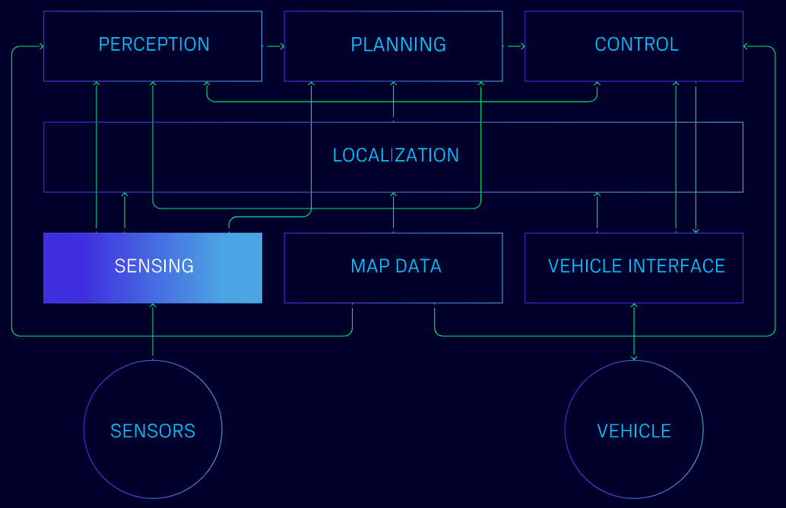

# Software

This is the software repository for the self-driving Ferrari project. The software is built on top of ROS2 and is designed to control the autonomous vehicle, process sensor data, and perform various tasks related to autonomous driving.

The low-level code (equivalent to the 'vehicle interface' in the architecture diagram) is implemented in the `firmware` directory of this repository, and it's running on a Teensy 4.1 microcontroller that uses interacts with the ROS2 network through micro-ROS.

### Package Structure

Being a ROS2 project, the software is organized in multiple packages, each with a specific responsibility. The following diagram illustrates the high-level architecture of the system:

- Sensing: Sensor data is collected from LiDAR, radars, camera, GNSS, IMU, and other sensors mounted on the autonomous vehicle.
- Localization: Sensor data, along with high-precision map data, is used to determine the precise location and orientation of the autonomous vehicle.
- Perception: Detection, recognition and tracking of the movement of objects such as vehicles, bicycles, and pedestrians, as well as the traffic signals and signs.
- Planning: Calculating the path of the vehicle along the desired route using perceptual information to avoid any objects and/or obstacles.
- Control: Planning information is translated into precise vehicle control signals (e.g., steering angle, braking, and acceleration) and sent through the vehicle interface.
- Mapping: Utilizing high-precision 3D map data to provide scene understanding around the environment.
- Vehicle Interface (external): Converting the control signals into commands according to various vehicle characteristics.

